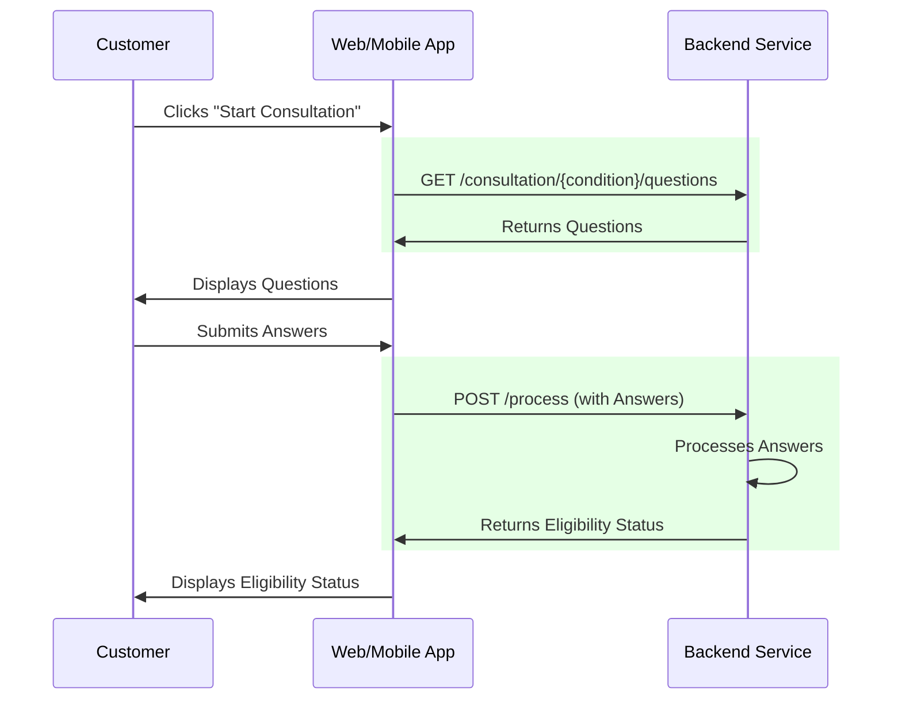

# MedExpress Consultation

## Overview

A service which serves the backend of MedExpress's consultation process.

The consultation process comprises the following steps:
1. A user is asked a series of questions relating to a condition they are experiencing to determine 
their eligibility for a medicine used to treat said condition.
2. The answers they provide then inform a response served to the frontend indicating whether they 
are eligible for medication (subject to a doctor's review).

The following sequence diagram shows an abridged subsection of the broader MedExpress process, 
relevant to this service. The interactions actually performed by this service are highlighted in 
green: 



## Requirements

- Java 17
- Maven
- The desire to remedy your condition!

## Design

A select few explanations follow, outlining the rationale underpinning some of the less obvious
design decisions made:

- It is assumed that the frontend validates the consultation result's prospective patient email 
address and name. This validation could and should be reinforced by this service, but such measure
has been omitted in the interest of time for this MVP.

- It is assumed that a prospective patient doesn't need to sign-up/login to submit a consultation 
result. The requirement for sign-up/login would only arise at the point where a _prospective_ patient
becomes a patient (i.e. point of payment for any medication for which they are deemed eligible).

- It is assumed that the condition id attribute is already available to the frontend when the user sends 
the precursory "Start Consultation" request and therefore can be sent as a path variable to 
`/consultation/{conditionId}/questions` when retrieving consultation questions. _If this were not 
the case, we could perhaps assume the name attribute is available and join the Condition and 
Question tables on the conditionId attribute to find matching Question entities._

- All consultation questions are framed such that yes/no answers (with the option for adding supporting text) are
expected. This is primarily for simplicity's sake given the project's restrictive time-boxing.

- Questions might have been stored as embedded entities within their owning consultation entities, 
however, question's id attribute is used as a reference point for answers, so it was decided that
it made sense for them to have their own table.

## Tech

A brief set of explanations follows, outlining the rationale underpinning the tech decisions made:

- Java 17 was selected as it's more than modern and stable enough for this project's requirements. 
Additionally, I personally haven't yet had enough exposure to Java 21 to make a good case for its 
use, over Java 17.
- The project was written as a Spring Boot microservice for a number of reasons:
  - ease of development (takes care of a lot of boilerplate)
  - embedded server included
  - by virtue of the task brief, there is no existing code to have to integrate with. Had this been 
  posed as a feature to add to, say, an existing modulith, this MVP might have been written as a module 
  within said modulith.
- Maven is used as a build tool primarily because it is the option with which I am most familiar! 
It also has an excellent ecosystem and is popular enough so that it is likely that any future 
developers working on this project, would also be familiar with it.
- H2 in-memory storage was used as a means to keep the service's data access uncomplicated and fast. 
H2 possesses enough functionality so that data access can, at least to some degree, be realistically 
emulated for this MVP.

## Running Locally

To run this application locally, please follow the following steps:

1. Clone this repository to your local machine:
```
git clone <repository-url>
```
2. Navigate to the project root:
```shell
cd medexpress-consultation
```
3. Build the project:
```shell
mvn clean install
```
4. Run the project:
```shell
mvn spring-boot:run
```

### Exercising the API

Below are some examples of ways in which the API can be exercised. I have taken the liberty of 
adding example data (see [data.sql](src/main/resources/data.sql) and 
[schema.sql](src/main/resources/schema.sql)) for use in this manner. 

_[cURL](https://curl.se/) is used for demonstration purposes (you'll need to paste these into your 
own cmd line tool to run them):_

An example get request for a consultation's questions:
```
curl -X GET "http://localhost:8080/consultation/1/questions"
```
An example post request, submitting a consultation:
```
curl -X POST "http://localhost:8080/consultation/process" -H "Content-Type: application/json" -d "{\"prospectivePatientEmailAddress\": \"asthmasufferer92@gmail.com\", \"prospectivePatientName\": \"Jason Bourne\", \"answers\": [{\"questionId\": 1, \"responseRequiredForMedication\": true, \"text\": \"aye\", \"yesNoValue\": true}, {\"questionId\": 2, \"responseRequiredForMedication\": null, \"text\": \"I smoked for 10 years\", \"yesNoValue\": true}]}"
```

## Ideas for Extension

Will do:

1. A check should take place, when a consultation is submitted, to see whether there are any existing
   consultation results for the same condition, with eligibility status UNDER_REVIEW and a matching
   email address. If there is at least one such existing result and the answers differ at all, there
   are several possible ways of handling this:
    1. add some synchronisation mechanism which is set to "locked"  if a doctor is currently reviewing a
       submitted consultation result (perhaps denoted by the addition of another eligibility status,
       differentiating between pre-review (pending) and in review (under review)). If the existing
       consultation result is locked, disallow the overwriting of the submitted consultation result;
       otherwise, permit the overwriting if the answers differ at all.
    2. Disallow overwriting until the existing consultation result has been reviewed and a decision
       reached (and email sent) by the reviewing doctor.
2. Add program argument option for enabling/disabling population of test data 
([data.sql](src/main/resources/data.sql) and [schema.sql](src/main/resources/schema.sql))
3. Further testing (beyond unit testing; int tests, controller tests etc.). As the application
   grows, would want load/performance testing too (e.g. Gatling)
4. More sophisticated indicative eligibility messaging (e.g. if it can be inferred from the
   prospective patient's answers that they are at serious risk, this should be relayed to them).

Could do:

1. Save partial consultation result if the form is abandoned before submission (ideally cached in 
some way, for some period of time).
2. Tooling for support users to perform CRUD ops on the main types where appropriate (Condition, 
Question, etc.)
3. Add logging for better application visibility and ease of debugging if an issue arises.
4. Add the concept of universal questions, common to most/all consultations, which do not possess a 
condition id (e.g. "Do you consent to a doctor reviewing your answers?"). These could perhaps be 
cached to reduce consultation load time.

## Open API Documentation

For further API documentation, see the [OpenAPI Specification](spec.yaml).
