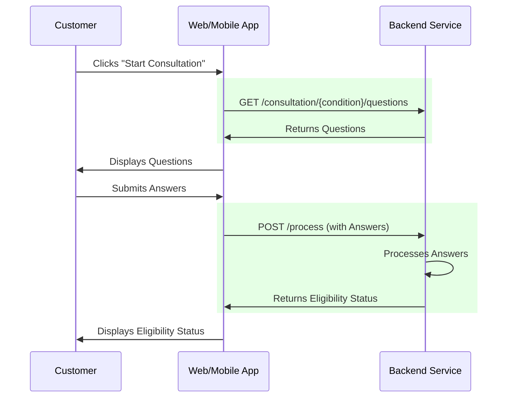

# MedExpress Consultation

## Overview

A service which serves the backend of MedExpress's consultation process.

The consultation process comprises the following steps:
1. A user is asked a series of questions relating to a condition they are experiencing to determine 
their eligibility for a medicine used to treat said condition.
2. The answers they provide then inform a response served to the frontend indicating whether they 
are eligible for medication.

The following sequence diagram shows an abridged subsection of the broader medexpress process, 
relevant to this service. The interactions actually performed by this service are highlighted in 
green: 



## Requirements

- Java 17
- Maven
- A desire to remedy your condition!

## Design

### Assumptions

A select few explanations follow, outlining the rationale underpinning some of the less obvious
design decisions made:

- It is assumed that the Condition id attribute is available to the frontend when the user sends 
the precursory "Start Consultation" request and therefore can be sent as a path variable to 
`/consultation/{conditionId}/questions` when retrieving consultation questions. _If this were not 
the case, we could perhaps assume the name attribute is available and join the Condition and 
Question tables on the conditionId attribute to find matching Question entities._

- All questions are framed such that yes/no answers (with the option for adding supporting text) are
expected. This is primarily for simplicity's sake given the project's 2-3 hour time-box 
recommendation.

## Tech

A brief set of explanations follows, outlining the rationale underpinning the tech decisions made:

- Java 17 was selected as it's more than modern and stable enough for this project's requirements. 
Additionally, I personally haven't yet had enough exposure to Java 21 to make a good case for its 
use, over Java 17.
- The project was written as a Spring Boot microservice for a number of reasons:
  - ease of development (takes care of a lot of boilerplate)
  - embedded server included
  - by virtue of the task brief, there is no existing code to have to integrate with. Had this been 
  posed as a feature to add to, say, a modulith, this MVP might have been written as a module 
  within said modulith.
- Maven is used as a build tool primarily because it is the option with which I am most familiar. 
It also has an excellent ecosystem and is popular enough so that it is likely that any future 
developers working on this project, would also be familiar with it.
- H2 in-memory storage was used as a means to keep the service's data access uncomplicated and fast. 
H2 possesses enough functionality so that data access can, at least to some degree, be realistically 
emulated for this MVP.

## Running Locally

To run this application locally, please follow the following steps:

1. Clone this repository to your local machine:
```
git clone <repository-url>
```
2. Navigate to the project root:
```shell
cd medexpress-consultation
```
3. Build the project:
```shell
mvn clean install
```
4. Run the project:
```shell
mvn spring-boot:run
```

## Ideas for Extension

1. Save partial consultation result if the form is abandoned before submission. This of course, may 
require re-authentication for resumption.
2. Tooling for support users to perform CRUD ops on:
   1. conditions (inc. questions)
   2. users
   3. etc.